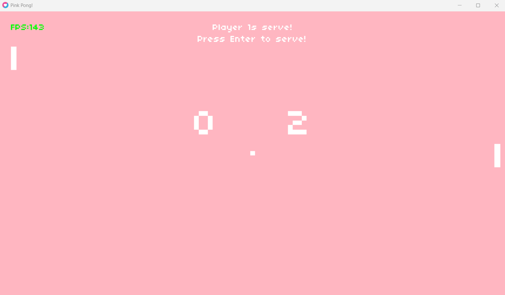

# Pink Pong

**Pink Pong** is a simple, pink-themed clone of the classic Pong game, developed using **Lua** and the **LÖVE 2D framework** as part of the CS50: Introduction to Game Development course.

## Features
- Classic Pong gameplay with a playful pink aesthetic
- Player vs Computer mode (PVC)
- Ball speed increases with each bounce
- Minimalist design focused on core mechanics

## Screenshots


## Technologies Used
- [Lua](https://www.lua.org/)
- [LÖVE 2D](https://love2d.org/)

## How to Play
1. Make sure you have [LÖVE 2D](https://love2d.org/) installed on your system.
2. Download or clone this repository.
3. Run the game by dragging the project folder onto the LÖVE executable, or run it from terminal:
   ```bash
   love .
4. Player 1 uses W and S to move.
5. The computer controls the right paddle automatically.

## Credits
Developed by Carolina Sanchez as a part of a learning project during the CS50 course by Harvard University.

## Licence
This project is shared for educational purposes only. 
Feel free to explore, learn from, or remix the code for your own non-commercial projects.
